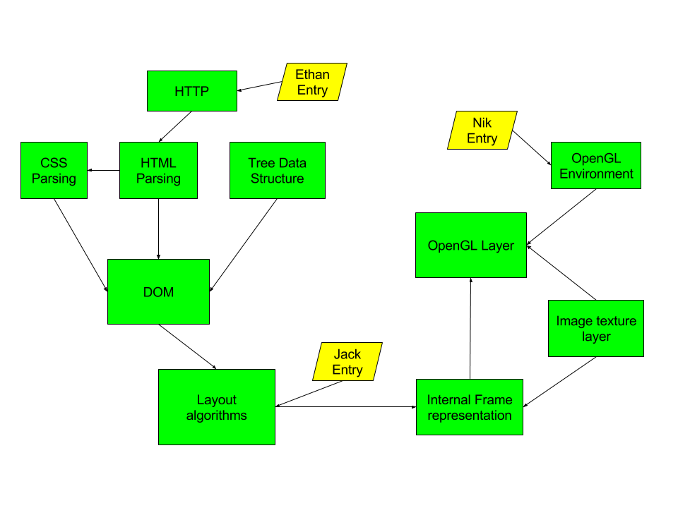

#Andreessen
###A simple web browser, written in pure C++, with no external libraries

By [Jack Fischer](https://github.com/jackfischer), [Nik Vanderhoof](https://github.com/nvander1), and [Ethan Schoen](https://github.com/EthanSchoen)

In honor of this guy! Submitted to Cornell BigRedHacks in Fall 2016

###Architecture
We rewrote facilities for the entire stack, ranging from HTTP over TCP/IP, to internal algorithms, to render.

